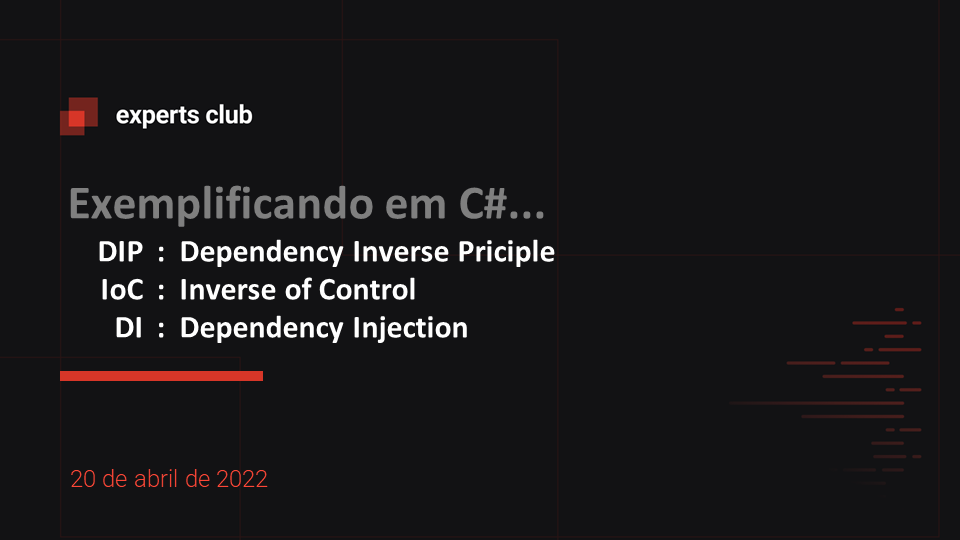
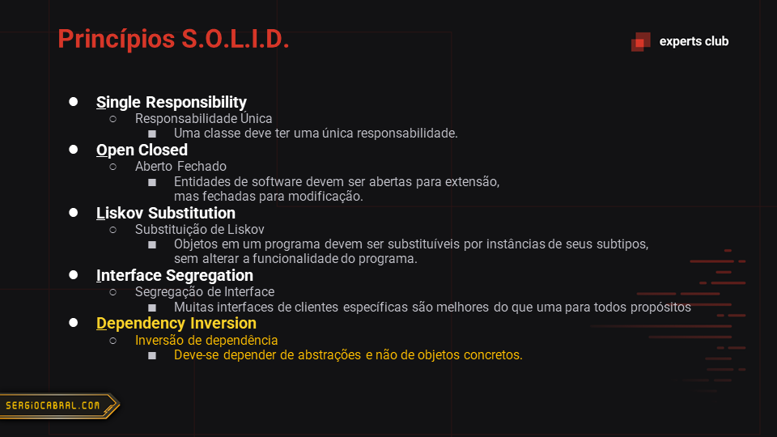
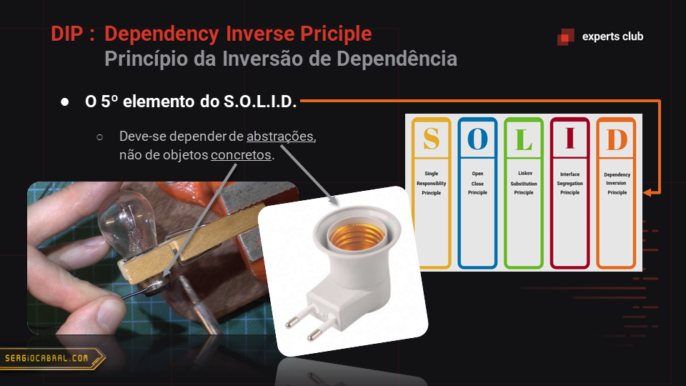
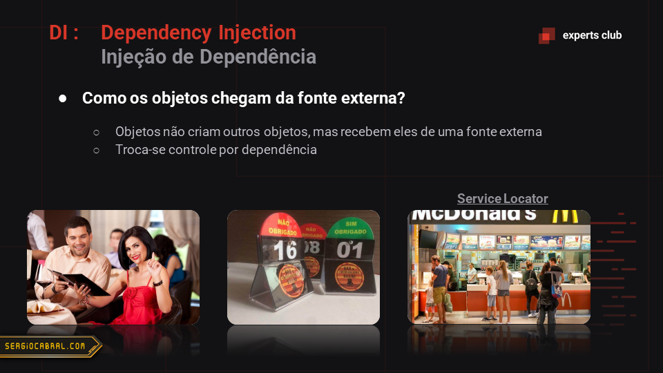

# WhoisDomain

Este repositório contem um aplicativo para consulta de informações de domínios de internet.

Forma de usar:

```
WhoisDomain.exe sergiocabral.com amazon.com etcetera.com
```

## DIP vs. IoC vs. DI

O projeto exemplifca os três pontos abaixo.
Cada um deles é citado nos commits relacionados. 

- **DIP**: Dependency Inverse Principle (Princípio da Inversão de Dependência) 
- **IoC**: Inverse of Control (Inversão de Controle)
- **DI**: Dependency Injection (Injeção de Dependência)

## Slides da aula










## Expert

| [](https://github.com/sergiocabral) |
| :-: |
|[sergiocabral.com](https://sergiocabral.com)|
